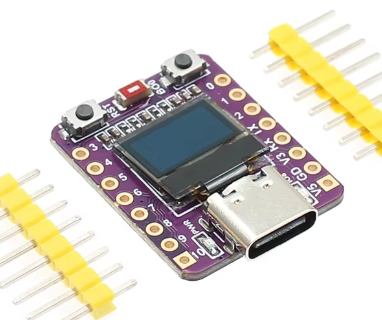

# ESPHome Workshop - BSides Sydney

This workshop will help you get up an running with the ESPHome platform as a useful, low-code means of configuring, compiling and creating your very own IoT devices.

## What is ESPHome?

ESPHome is an open-source framework that allows you to easily create custom firmware for ESP8266 and ESP32 microcontrollers, enabling them to integrate seamlessly with smart home systems like Home Assistant. It uses simple YAML-based configuration files to define sensors, switches, lights, displays, and automations, which are then compiled into firmware and uploaded to the device. By abstracting away low-level programming, ESPHome makes it easy for users, from hobbyists to advanced developers—to build reliable, connected IoT devices for home automation, monitoring, and control.

-- ChatGPT

## Starter Pack
You will be supplied a starter pack containing:

- ESP32-C3 0.42 OLED (Closest reference: [emalliab](https://emalliab.wordpress.com/2025/02/12/esp32-c3-0-42-oled/), [Datasheet](https://documentation.espressif.com/esp32-c3_datasheet_en.pdf))

  

- USB Cable
- F-F Dupont Cables
- AHT30 Temperature and Humidity Sensor ([Datasheet](https://eleparts.co.kr/data/goods_attach/202306/good-pdf-12751003-1.pdf))

  


## What software tools do I need?

You'll need a working installation of ESPHome. This can take the form of an extension within Home Assistant, or as we shall focus on, as a command line tool.

[https://esphome.io/guides/installing_esphome/](https://esphome.io/guides/installing_esphome/)

IMO the simplest way to install ESPHome is simply as a python package.

Once installed, `esphome -h`


## Example ESPHome configurations

The core of all ESPHome configurations is YAML, (https://esphome.io/guides/yaml/)

Your best friend for resources will be the ESPHome website. [(https://esphome.io/components/)](https://esphome.io/components/)


### Clean Slate
Every ESP32-C3 has been pre-flashed with the [`cleanstate.yaml`](cleanstate.yaml) configuration.


### Complete Example
A complete example that connects the ESP32-C3 to a wireless network, synchronizes the datetime over the internet, interfaces with the OLED, and AHT30 sensor over I2C, and displays measurements is provided in [`complete.yaml`](complete.yaml).


In this example, the supplied 4 wire F-F connector should map as follows:

| AHT30 Pins | ESP32-C3 Pins |
| ---------- | -------- |
| VIN (Vin, for power and logic level) | V3 (3.3V Regulated ESP supply) |
| GND (Ground)       | GD (ESP32 Ground) |
| SCL (I2C Serial Clock) | 5  (GPIO5) |
| SDA (I2C Serial Data)  | 6  (GPIO6) |

Many modern microcontrollers feature a GPIO matrix that allows for remapping of functional connections (e.g. ADC, DAC, IO, UART, I2C) to other physical pins. We have declared in our `.yaml` the use of GPIO 5 and 6 for the I2C bus.

### Managing Secrets
An example secrets file is presented in [`example-secrets.yaml`](example-secrets.yaml)
Create your own `secrets.yaml` before attempting to compile the complete configuration.

```cp example-secrets.yaml secrets.yaml```

### Building and Flashing
It is very important that all devices have a unique name, as the device name will become the hostname for this device.

The last step on your `esphome` installation, run the following, where the name of the target configuration is the last argument.

`esphome run cleanstate.yaml`

`esphome run complete.yaml`

